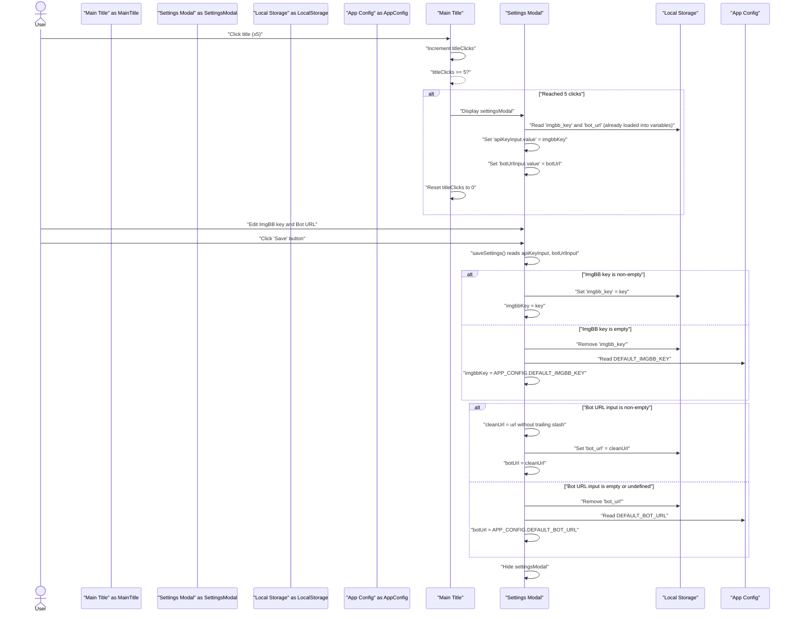
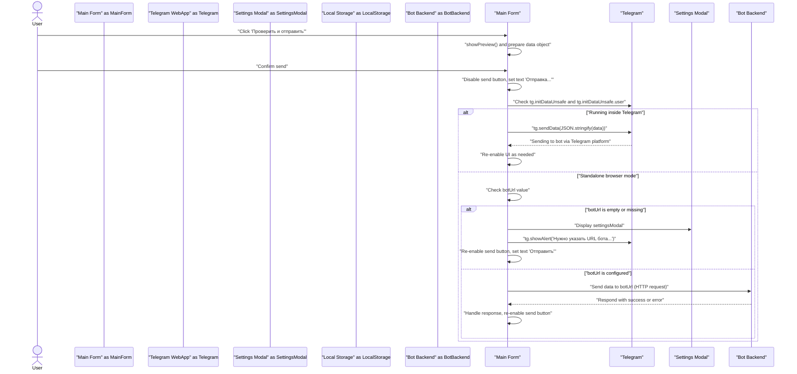
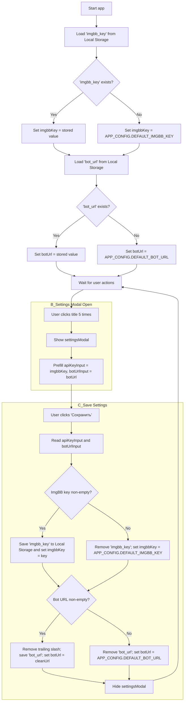

# Modern Bot

This is the refactored and improved version of the conclusion bot, featuring a standalone web app mode.

## Features
- **Modular Structure**: Clean code organized in `modern_bot/`.
- **Web App**: "Fool-proof" data entry via a Telegram Mini App.
- **Standalone Mode**: Use the Web App in any browser (Chrome, Safari) to generate documents without Telegram.
- **Monetization**: `/broadcast` command to send messages to all users.
- **Improved Reports**: Better archive handling and stats.

## How to Run
1.  Ensure you are in the project root (`/Users/oleg/Project_SKLAD`).
2.  Run the bot:
    ```bash
    python3 run_modern_bot.py
    ```
3.  **For Standalone Mode**: Start the ngrok tunnel:
    ```bash
    ./start_tunnel.sh
    ```
    *Note: The default URL in `index.html` is set to a specific ngrok address. If your tunnel URL changes, you must update it in the Web App settings.*

## Web App Setup
To use the Web App:
1.  Host the file `modern_bot/web_app/index.html` on a public server (GitHub Pages).
2.  **Standalone Access**: Open the GitHub Pages URL directly in your browser.
    - If the "Bot URL" is not configured or incorrect, the app will prompt you to enter it (e.g., your ngrok URL).
    - **Secret Settings**: Tap the "Новое заключение" title 5 times rapidly to open settings manually.

## Admin Commands
- `/add_admin <ID>`
- `/broadcast <Message>`
- `/download_month <MM.YYYY>`
- `/stats`

## Architecture & Flows

### Settings & Configuration Flow


### Submission Flow


### Initialization Logic

